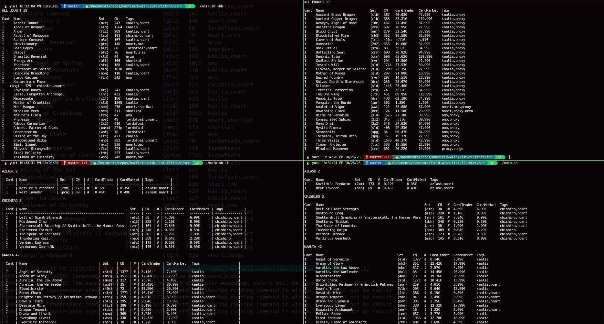

# Moxfield wish list helper

1. Open a new tab and open element inspector: F12
2. Go to: [https://moxfield.com/wishlist](https://moxfield.com/wishlist)
3. Search request https://api2.moxfield.com/v2/wishlist
4. Right click -> Copy -> Copy reponse
5. Paste as a new file named `response.json` on `src/` folder
6. Execute by:
```shell
# requirements jq and csvkit
sudo apt update && sudo apt install -y jq csvkit # for ubuntu, you might use WSL on Windows
cd src
chmod +x main.sh

# options
./main.sh 	            # list format
./main.sh -t            # md table format
./main.sh -bh           # show only bought cards
./main.sh -ph           # show only proxy cards
./main.sh | cut -d# -f1 # remove pricing and tags
```
 


## Explanation

I do use several tags for keeping track on what I will buy or proxy and what I already bought and is still on track or in my collection

+ #proxy: means I will not buy that card, probably because it is expensive
+ #noart: means I do not care the art of that card so any collection is good
+ #bought: means I already bought it, I am waiting fot its arrival. Once they are on my hands I add them to my collection and remove it from wish list
+ #decktag: means that card is for <decktag> deck. This kind of tag is used when I am buying new cards, to segregate and prioritize 

Also I have several global tags that i do not want to filter by, so I add them to the script `BASIC_FILTER` variable, ex: destroy, counter and tutor. Feel free to modify

## Example output

### List

```
ALL PROXYS 33

Cant  Name                        Set    CN    CardTrader  CardMarket
1     Ancient Brass Dragon        (clb)  367   40.03€      47.99€
1     Ancient Copper Dragon       (clb)  368   83.31€      119.99€
...

ALL BOUGHT 34

Cant  Name                                        Set    CN    Tags
1     Access Tunnel                               (mkc)  247   tags:kaalia, noart
1     Angel of Despair                            (sld)  1564  tags:kaalia
...

PENDING

AZLASK 2

Cant  Name                Set    CN      CardTrader  CardMarket
1     Kozilek's Predator  (2xm)  173  #  0.12€       0.35€
1     Nest Invader        (pca)  69   #  0.45€       0.49€
...
```

## Table

```
ALL PROXYS 33

Cant  Name                        Set    CN    CardTrader  CardMarket
1     Ancient Brass Dragon        (clb)  367   40.03€      47.99€
1     Ancient Copper Dragon       (clb)  368   83.31€      119.99€
...

ALL BOUGHT 34

Cant  Name                                        Set    CN    Tags
1     Access Tunnel                               (mkc)  247   tags:kaalia, noart
1     Angel of Despair                            (sld)  1564  tags:kaalia
...

PENDING

AZLASK 2

| Cant | Name               | Set   | CN  | # | CardTrader | CardMarket |
| ---- | ------------------ | ----- | --- | - | ---------- | ---------- |
| 1    | Kozilek's Predator | (2xm) | 173 | # | 0.12€      | 0.35€      |
| 1    | Nest Invader       | (pca) | 69  | # | 0.45€      | 0.49€      |
...
```

## Technical debt

+ Moxfield API is closed and has Cloudflare protecting it. So any effort on automating this part is meaningless. It would be nice to fully automate it and keep track against CardTrader or CardMarket APIs.